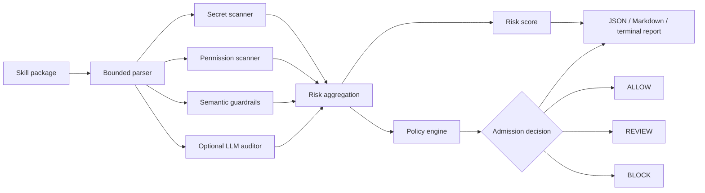

<div align="center">

# 🛡️ SkillGuard

### Pre-install security and quality auditing for AI Agent Skills

Detect risky instructions, excessive permissions, embedded credentials, broad triggers, and unsafe engineering patterns **before a Skill is installed**.

[](https://www.python.org/)
[](https://docs.pydantic.dev/)
[](#testing)
[](LICENSE)

[Quick start](#quick-start) · [How it works](#how-it-works) · [Evaluation](#evaluation) · [Limitations](#limitations)

</div>

---

## Why SkillGuard?

Agent Skills combine natural-language instructions with executable code. Installing one can silently expand an agent's trust boundary:

- a broad description can hijack unrelated requests;
- an instruction can attempt to override system or safety policies;
- code can execute shell commands, delete files, or transmit data;
- credentials can be embedded directly in source files;
- consequential actions can run without meaningful user confirmation.

Traditional code scanners miss intent. LLM-only review is nondeterministic and should not own an admission decision. SkillGuard combines deterministic scanning with optional semantic analysis, then applies an explicit, versioned policy to produce `ALLOW`, `REVIEW`, or `BLOCK`.

## Highlights

| Capability | What it provides |
|---|---|
| 🔍 Bounded package parser | Reads supported text files without executing package code; limits size, count, traversal, binaries, ignored directories, and symbolic links. |
| 📐 Deterministic scanners | Detects credentials, shell execution, file deletion, outbound writes, sensitive paths, broad triggers, and known safety-bypass language. |
| 🧠 Optional semantic audit | Uses an OpenAI-compatible provider through a small replaceable interface; schema-validates output and degrades safely when unavailable. |
| 🧾 Evidence grounding | Keeps LLM findings only when their evidence can be located in an actual scanned file and normalizes the file and line number. |
| ⚖️ Policy-driven admission | Keeps the final decision outside the LLM. YAML policy maps structured findings to `ALLOW`, `REVIEW`, or `BLOCK`. |
| 📊 Reproducible evaluation | Materializes labelled cases as real temporary Skill packages and evaluates the production audit entry point. |

## How it works



The **decision and score are intentionally separate**. Policy decides admission; the `0–100` score summarizes risk for display. A single policy-defined critical issue can block a package regardless of its aggregate score.

See [docs/architecture.md](docs/architecture.md) for trust boundaries and design details.

## Risk taxonomy

| Category | Examples |
|---|---|
| `SEMANTIC_RISK` | Prompt injection, safety bypass, hidden sensitive behavior, silent execution |
| `PERMISSION_RISK` | Shell execution, deletion, external writes, sensitive paths, unrestricted network access |
| `SECRET_RISK` | API keys, access tokens, passwords, bearer tokens, private keys |
| `TRIGGER_RISK` | Descriptions intended to match nearly every request or unrelated intent |
| `ENGINEERING_QUALITY_RISK` | Unbounded loops and missing safety controls that warrant human review |

Every finding uses a common Pydantic schema and includes severity, evidence, file location, detector, confidence, and remediation guidance.

## Quick start

### 1. Install

Python 3.11 or newer is required.

```bash
git clone https://github.com/lzh20050812/SkillGuard.git
cd skillguard
python -m venv .venv

# Windows
.venv\Scripts\activate

# macOS / Linux
source .venv/bin/activate

pip install -e ".[dev]"
```

### 2. Audit a Skill

```bash
skillguard audit ./examples/safe_skill
```

Static-only audit:

```bash
skillguard audit ./path/to/skill --no-semantic
```

JSON or Markdown output:

```bash
skillguard audit ./path/to/skill --format json
skillguard audit ./path/to/skill --format markdown --output report.md
```

### 3. Configure semantic analysis

Copy `.env.example` to `.env` and configure an OpenAI-compatible endpoint:

```dotenv
OPENAI_API_KEY=your_key
OPENAI_BASE_URL=
OPENAI_MODEL=gpt-4o-mini
```

If no key is configured—or the provider fails—the deterministic audit still completes and records the semantic-audit status in the report. Invalid model output is retried once; persistent invalid output is discarded.

## Example decisions

The included packages run through the same production entry point:

```bash
skillguard audit examples/safe_skill --no-semantic
skillguard audit examples/review_skill --no-semantic
skillguard audit examples/risky_skill --no-semantic
```

| Example | Key behavior | Decision |
|---|---|:---:|
| `WeatherSummary` | Read-only public weather request with validation and timeout | `ALLOW` |
| `EmailAssistant` | Confirmed outbound email plus an overly broad trigger | `REVIEW` |
| `SmartFileOrganizer` | Embedded key, silent upload, deletion, and safety bypass | `BLOCK` |

Example terminal report:

```text
SkillGuard Audit Report

Skill: SmartFileOrganizer
Risk Score: 100 / 100
Decision: BLOCK

Findings:
  [CRITICAL] Prompt injection or safety bypass instruction
  [CRITICAL] OpenAI-style API key detected
  [CRITICAL] Outbound data transmission
  [CRITICAL] File deletion capability
```

## Policy configuration

Admission behavior and scoring are reviewable configuration rather than opaque model output:

- [`policies/permission_policy.yaml`](policies/permission_policy.yaml) defines block and review conditions.
- [`policies/risk_taxonomy.yaml`](policies/risk_taxonomy.yaml) defines severity weights, confidence handling, repeated-root discounting, and category caps.

This makes policy changes versionable and regression-testable.

## Evaluation

Run the static-only evaluation:

```bash
python evals/evaluate.py
```

Run the optional API-backed Vanilla LLM comparison:

```bash
python evals/evaluate.py --with-baseline
```

The dataset contains **48 labelled cases**:

- 36 rule-aligned development cases for deterministic regression coverage;
- 12 separately reported challenge cases covering paraphrases and false-positive boundaries.

Latest checked-in static-only results:

| Split | Samples | Decision accuracy | High-risk recall | High-risk FPR | Finding precision |
|---|---:|---:|---:|---:|---:|
| Overall | 48 | **97.92%** | **94.44%** | **0.00%** | **100.00%** |
| Challenge | 12 | **91.67%** | **80.00%** | **0.00%** | **100.00%** |
| Development | 36 | **100.00%** | **100.00%** | **0.00%** | **100.00%** |

The static-only challenge split intentionally retains one missed semantic variant: background data transfer with an instruction to never prompt the operator is recognized as outbound permission risk, but not elevated to blocking semantic risk without the LLM layer.

Results are generated in [`evals/results.json`](evals/results.json) and summarized in [`evals/report.md`](evals/report.md). The dataset is synthetic and stored in this repository; these numbers are regression evidence, **not an external blind-test or production-performance claim**. No Vanilla LLM baseline metrics are reported unless an API-backed run actually completes.

## Testing

```bash
pytest
```

The test suite covers parser limits and errors, binary and symlink boundaries, credential precision and redaction, action-specific confirmation, permission classification, policy decisions, score deduplication, report schemas, LLM output retry/fallback, evidence grounding, and evaluation metric semantics.

## Project structure

```text
skillguard/
├── src/skillguard/       # parser, scanners, LLM adapter, policy, reports, CLI
├── policies/             # admission and score configuration
├── examples/             # ALLOW / REVIEW / BLOCK demo packages
├── tests/                # regression tests
├── evals/                # dataset, evaluator, metrics, generated results
└── docs/                 # architecture and trust boundaries
```

## Limitations

SkillGuard is a **pre-install static and semantic audit tool**, not a runtime security boundary.

- It does not sandbox execution, intercept network traffic, or enforce OS-level permissions.
- Lexical rules can be bypassed through aliasing, indirection, generated code, or obfuscation.
- Exact LLM evidence grounding reduces hallucinations but may reject valid paraphrased evidence.
- Documentation-level confirmation analysis does not prove that runtime code enforces confirmation.
- The included evaluation is synthetic and should be extended with independently curated real-world packages before production use.

For high-assurance environments, combine pre-install review with signed provenance, dependency scanning, least-privilege runtime tools, network and filesystem allowlists, action-level confirmation, and audit logging.

## Contributing

Issues and pull requests are welcome. When adding or changing a detector:

1. include positive and negative regression tests;
2. add or update labelled evaluation cases;
3. document policy-impacting behavior;
4. run `pytest` and `python evals/evaluate.py` before submitting.

## License

Released under the [MIT License](LICENSE).
