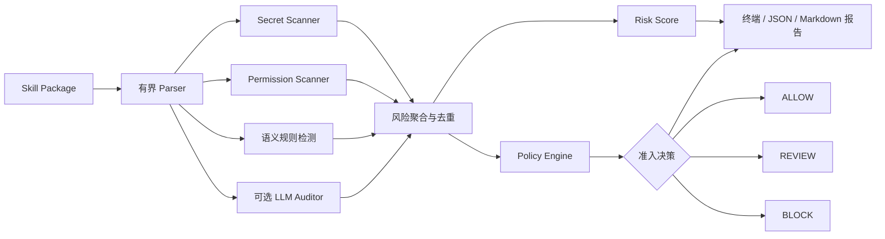

<div align="center">

# 🛡️ SkillGuard

### AI Agent Skill 安装前安全与质量准入审查工具

在 Skill 安装之前，识别恶意语义指令、敏感权限、硬编码凭证、宽泛触发条件和工程安全缺陷。

[](https://www.python.org/)
[](https://docs.pydantic.dev/)
[](#测试)
[](LICENSE)

[快速开始](#快速开始) · [工作原理](#工作原理) · [评测结果](#评测结果) · [项目限制](#项目限制)

</div>

---

## 为什么需要 SkillGuard？

Agent Skill 同时包含自然语言指令和可执行代码。安装一个 Skill，实际上是在扩大 Agent 的能力范围和信任边界：

- 过于宽泛的 Description 可能劫持大量无关请求；
- 恶意指令可能尝试覆盖系统规则或绕过安全策略；
- 代码可能执行 Shell、删除文件或向外部发送数据；
- API Key、Token、密码等凭证可能被直接写入源码；
- 删除、发布、发送等高风险行为可能绕过用户确认。

传统代码扫描难以理解自然语言意图；单独依赖 LLM 又存在不稳定、不可复现和输出漂移的问题。SkillGuard 将**确定性静态扫描**与**可选 LLM 语义审计**结合，再通过显式、可版本化的策略引擎输出 `ALLOW`、`REVIEW` 或 `BLOCK`。

## 核心能力

| 能力 | 说明 |
|---|---|
| 🔍 有界 Skill Parser | 不执行 Skill 代码；限制文件大小、文件数量和遍历条目，忽略二进制、依赖目录和符号链接。 |
| 📐 确定性静态扫描 | 检测硬编码凭证、Shell 执行、文件删除、外部写入、敏感路径、宽触发和常见安全绕过语句。 |
| 🧠 可选语义审计 | 通过轻量、可替换接口接入 OpenAI-compatible API；校验结构化输出，并在模型不可用时安全降级。 |
| 🧾 LLM 证据落地 | 仅保留能够在真实扫描文件中定位的模型证据，并重新计算准确文件路径和行号。 |
| ⚖️ 策略驱动准入 | 最终决策不交给 LLM；由 YAML 策略根据结构化 Finding 生成三级准入结果。 |
| 📊 可复现评测 | 将每条标注样本物化为真实临时 Skill 包，并调用生产审计入口完成端到端评测。 |

## 工作原理



### Decision 与 Risk Score 相互独立

- **Decision**：由明确的策略规则决定是否准入。
- **Risk Score**：`0–100` 风险展示分，用于表达风险密度。

一个满足策略阻断条件的关键风险可以直接触发 `BLOCK`，即使累计分数不高。SkillGuard 不使用简单的“分数大于某阈值就阻断”。

更多设计细节见 [架构文档](docs/architecture.md)。

## 风险分类

| 风险类型 | 典型问题 |
|---|---|
| `SEMANTIC_RISK` | Prompt Injection、安全绕过、隐藏行为、静默执行敏感操作 |
| `PERMISSION_RISK` | Shell 执行、文件删除、外部写入、敏感路径、网络访问 |
| `SECRET_RISK` | API Key、Access Token、密码、Bearer Token、Private Key |
| `TRIGGER_RISK` | Description 试图匹配几乎所有请求或大量无关意图 |
| `ENGINEERING_QUALITY_RISK` | 无限循环、失败处理和安全控制不足等需要人工审查的问题 |

所有检测模块统一输出 Pydantic `RiskFinding`，包含：

- 风险类别与严重等级；
- 原始证据、文件路径和行号；
- 检测器、置信度与规则 ID；
- 风险说明和修复建议。

## 快速开始

### 1. 安装

需要 Python 3.11 或更高版本。

```bash
git clone https://github.com/lzh20050812/SkillGuard.git
cd SkillGuard
python -m venv .venv

# Windows
.venv\Scripts\activate

# macOS / Linux
source .venv/bin/activate

pip install -e ".[dev]"
```

### 2. 审计一个 Skill

```bash
skillguard audit ./examples/safe_skill
```

仅运行确定性静态审计：

```bash
skillguard audit ./path/to/skill --no-semantic
```

输出 JSON 或 Markdown 报告：

```bash
skillguard audit ./path/to/skill --format json
skillguard audit ./path/to/skill --format markdown --output report.md
```

### 3. 配置 LLM 语义审计

复制 `.env.example` 为 `.env`，配置任意 OpenAI-compatible API：

```dotenv
OPENAI_API_KEY=your_key
OPENAI_BASE_URL=
OPENAI_MODEL=gpt-4o-mini
```

如果没有配置 API Key，或模型服务调用失败，确定性静态审计仍会完整执行，并在报告中记录语义审计状态。

模型输出需要通过 Pydantic Schema 校验：

```text
首次输出无效
    ↓
自动重试一次
    ↓
仍然无效
    ↓
记录错误并继续静态审计
```

## Demo

仓库提供三个经过真实扫描的示例 Skill：

```bash
skillguard audit examples/safe_skill --no-semantic
skillguard audit examples/review_skill --no-semantic
skillguard audit examples/risky_skill --no-semantic
```

| 示例 | 关键行为 | 决策 |
|---|---|:---:|
| `WeatherSummary` | 带参数校验和超时的只读天气请求 | `ALLOW` |
| `EmailAssistant` | 用户确认后发送邮件，但 Trigger 范围过宽 | `REVIEW` |
| `SmartFileOrganizer` | 硬编码 Key、静默上传、删除文件和安全绕过指令 | `BLOCK` |

终端报告示例：

```text
SkillGuard Audit Report

Skill: SmartFileOrganizer
Risk Score: 100 / 100
Decision: BLOCK

Findings:
  [CRITICAL] Prompt injection or safety bypass instruction
  [CRITICAL] OpenAI-style API key detected
  [CRITICAL] Outbound data transmission
  [CRITICAL] File deletion capability
```

## 策略配置

准入规则和风险分配置均可审查、可版本化，不依赖不透明的模型决策：

- [`policies/permission_policy.yaml`](policies/permission_policy.yaml)：定义 `BLOCK` 和 `REVIEW` 条件。
- [`policies/risk_taxonomy.yaml`](policies/risk_taxonomy.yaml)：定义严重等级权重、置信度处理、重复根因折扣和类别分数上限。

这使得策略变更可以通过 Git 审查，并使用测试和评测集进行回归验证。

## 评测结果

运行 static-only Evaluation：

```bash
python evals/evaluate.py
```

运行可选的 Vanilla LLM 对照实验：

```bash
python evals/evaluate.py --with-baseline
```

当前数据集包含 **48 条标注样本**：

- 36 条与规则体系对齐的 development 样本，用于确定性回归测试；
- 12 条独立报告的 challenge 样本，覆盖语义变体和误报边界。

最新 static-only 评测结果：

| 数据范围 | 样本数 | 准入准确率 | 高风险召回率 | 高风险误报率 | Finding Precision |
|---|---:|---:|---:|---:|---:|
| 全量 | 48 | **97.92%** | **94.44%** | **0.00%** | **100.00%** |
| Challenge | 12 | **91.67%** | **80.00%** | **0.00%** | **100.00%** |
| Development | 36 | **100.00%** | **100.00%** | **0.00%** | **100.00%** |

Challenge split 特意保留了一个 static-only 漏检：系统识别出了“后台传输且永不提示”样本的外部写入权限，但没有仅靠静态语义规则将其提升为阻断级语义风险，最终得到 `REVIEW` 而不是 `BLOCK`。

完整结果位于：

- [`evals/results.json`](evals/results.json)：机器可读的逐样本结果；
- [`evals/report.md`](evals/report.md)：评测指标和逐样本报告。

数据集为仓库内维护的合成测试集。这些指标用于证明回归行为，**不是外部盲测结果，也不代表生产环境性能**。只有 API-backed 对照实验真实完成时，项目才会生成 Vanilla LLM baseline 指标。

## 测试

```bash
pytest
```

测试覆盖：

- Parser 文件大小、数量、遍历和异常边界；
- 二进制文件、符号链接与超大目录处理；
- 凭证检测、环境变量排除和证据脱敏；
- 动作级确认、权限分类与否定确认语义；
- Policy Decision、Risk Score 和根因去重；
- JSON / Markdown 报告；
- LLM Schema 重试、Provider 故障降级和证据落地；
- Evaluation 指标口径。

## 项目结构

```text
SkillGuard/
├── src/skillguard/       # Parser、Scanner、LLM、Policy、Report、CLI
├── policies/             # 准入策略与风险分配置
├── examples/             # ALLOW / REVIEW / BLOCK 示例
├── tests/                # 回归测试
├── evals/                # 数据集、评测脚本、指标和结果
└── docs/                 # 架构与信任边界
```

## 项目限制

SkillGuard 是一个**安装前静态与语义审计工具**，不是运行时安全边界。

- 不提供执行沙箱、网络拦截或 OS 级权限隔离。
- 基于词法的规则可能被别名、间接调用、动态代码或混淆绕过。
- 严格的 LLM 证据匹配可以降低幻觉，但也可能拒绝合理的改写证据。
- 文档层面的确认机制分析不能证明运行时代码一定执行了确认。
- 当前评测集是合成数据，生产使用前需要加入独立维护的真实 Skill 样本。

在高安全要求环境中，建议同时使用：依赖安全扫描、签名与来源验证、最小权限工具代理、文件与网络 Allowlist、动作级人工确认和运行时审计日志。

## 参与贡献

欢迎提交 Issue 和 Pull Request。新增或修改检测规则时，请同时：

1. 添加正向与负向回归测试；
2. 添加或更新标注评测样本；
3. 说明对准入策略的影响；
4. 运行 `pytest` 和 `python evals/evaluate.py`。

## License

本项目采用 [MIT License](LICENSE)。

