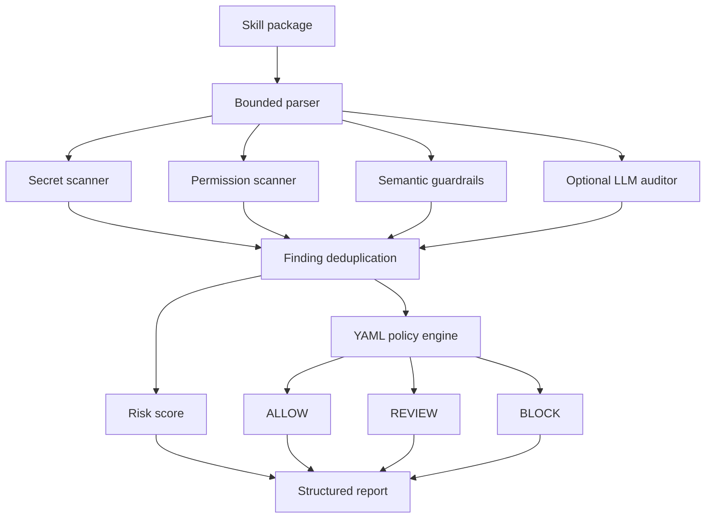

# Architecture

SkillGuard is a deterministic pre-install audit pipeline with an optional semantic enrichment stage.

## Trust boundaries

- Package files are untrusted. The parser reads only supported text formats, caps file size/count, ignores dependency and VCS directories, and never executes package code.
- Static findings are structured `RiskFinding` objects with evidence and location.
- Skill content is delimited as untrusted data in the LLM prompt. Invalid model output is retried once and then fails open to the deterministic static audit.
- The LLM never owns the admission decision. The YAML policy evaluates findings; the score is presentation-only.

## Policy and scoring

`permission_policy.yaml` defines admission conditions. Critical findings and named block conditions take precedence; high findings and review categories route to review. `risk_taxonomy.yaml` defines severity weights, confidence handling, repeated-root discounting, and per-category caps.

This design intentionally covers pre-install analysis, not runtime containment or behavioral monitoring.

